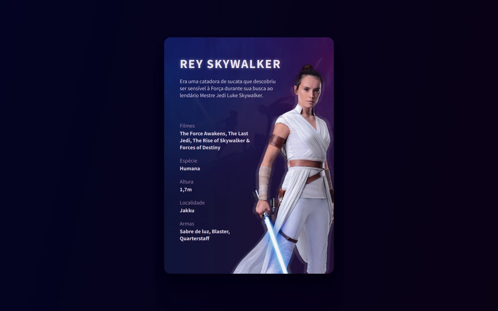

# <strong><h1 align="center">#boraCodar - Desafio 18</h1></strong>



Desenvolver uma landing page com cards usando o tema do Star Wars, usar criatividade para ir alem e mostrar como estou progredindo

## :rocket: Tecnologias 

Esse projeto foi utilizado:

- ViteJs
- ReactJs
- Typescript
- Sass

## Como executar o projeto

### Requisitos

- Nodejs
- PNPM (Gerenciador de pacotes para dependências do projeto.) Caso não tenha pode usar o Yarn ou NPM.

```bash
git clone https://github.com/AlysonDEV/boracodar-18.git
cd boracodar-18

pnpm install
pnpm run dev
```

Obs.: a etapa do gitclone pode ser ignorada caso você faça o download direto do projeto

## Preview

[Site preview](https://boracodar-18.vercel.app/)

Feito com ♥ by [AlysonDev](https://github.com/AlysonDEV)
